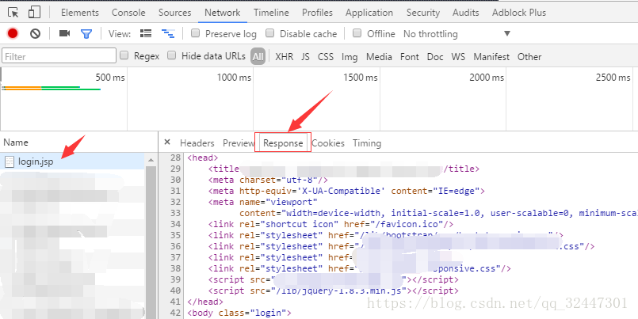
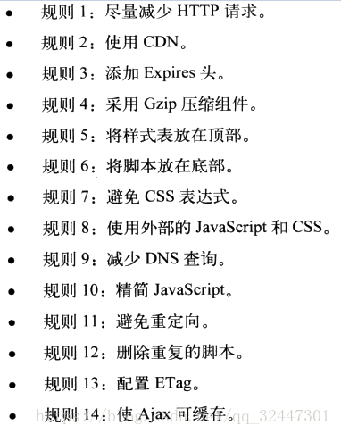
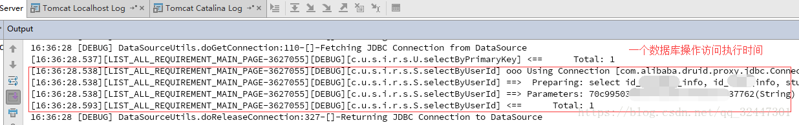
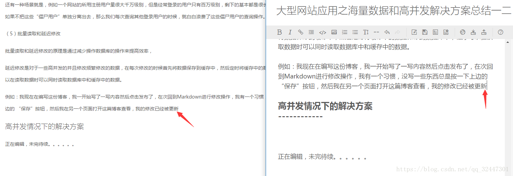
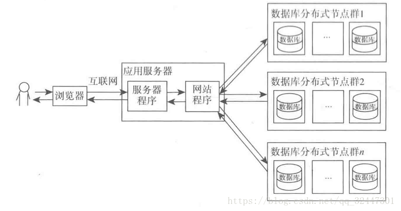
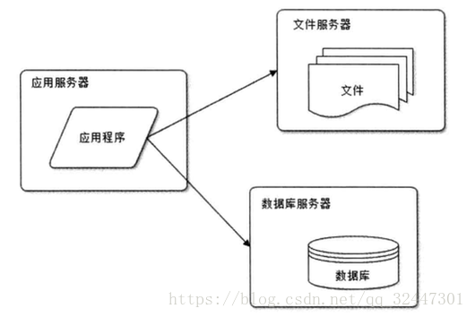
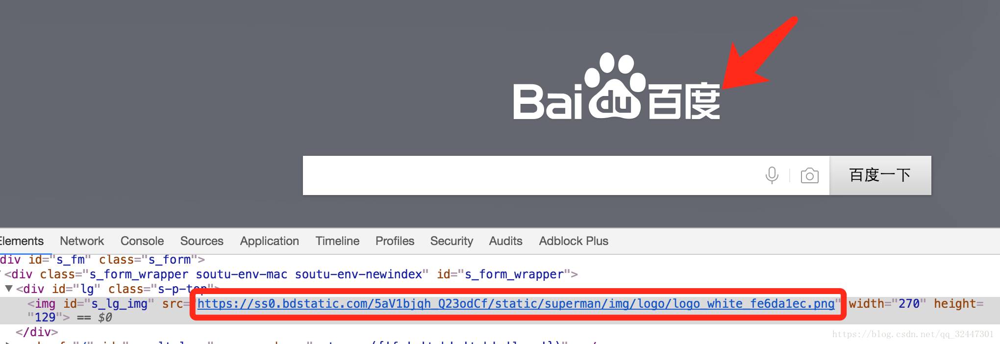
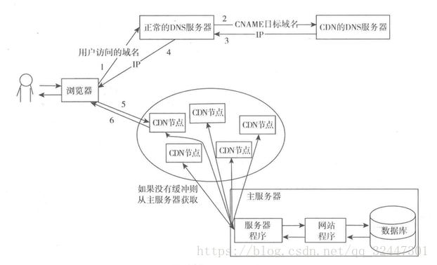

# 秒杀

## 1.秒杀方案 
设计思路 
将请求拦截在系统上游，降低下游压力：秒杀系统特点是并发量极大，但实际秒杀成功的请求数量却很少，所以如果不在前端拦截很可能造成数据库读写锁冲突，甚至导致死锁，最终请求超时。 
充分利用缓存：利用缓存可极大提高系统读写速度。 
消息队列：消息队列可以削峰，将拦截大量并发请求，这也是一个异步处理过程，后台业务根据自己的处理能力，从消息队列中主动的拉取请求消息进行业务处理。 
前端方案 
浏览器端(js)： 
页面静态化：将活动页面上的所有可以静态的元素全部静态化，并尽量减少动态元素。通过CDN来抗峰值。 
禁止重复提交：用户提交之后按钮置灰，禁止重复提交 
用户限流：在某一时间段内只允许用户提交一次请求，比如可以采取IP限流 
后端方案 
服务端控制器层(网关层) 
限制uid（UserID）访问频率：我们上面拦截了浏览器访问的请求，但针对某些恶意攻击或其它插件，在服务端控制层需要针对同一个访问uid，限制访问频率。 
服务层 
上面只拦截了一部分访问请求，当秒杀的用户量很大时，即使每个用户只有一个请求，到服务层的请求数量还是很大。比如我们有100W用户同时抢100台手机，服务层并发请求压力至少为100W。 
采用消息队列缓存请求：既然服务层知道库存只有100台手机，那完全没有必要把100W个请求都传递到数据库啊，那么可以先把这些请求都写到消息队列缓存一下，数据库层订阅消息减库存，减库存成功的请求返回秒杀成功，失败的返回秒杀结束。 
利用缓存应对读请求：对类似于12306等购票业务，是典型的读多写少业务，大部分请求是查询请求，所以可以利用缓存分担数据库压力。 
利用缓存应对写请求：缓存也是可以应对写请求的，比如我们就可以把数据库中的库存数据转移到Redis缓存中，所有减库存操作都在Redis中进行，然后再通过后台进程把Redis中的用户秒杀请求同步到数据库中。 
数据库层 
数据库层是最脆弱的一层，一般在应用设计时在上游就需要把请求拦截掉，数据库层只承担“能力范围内”的访问请求。所以，上面通过在服务层引入队列和缓存，让最底层的数据库高枕无忧。 
案例：利用消息中间件和缓存实现简单的秒杀系统 
Redis是一个分布式缓存系统，支持多种数据结构，我们可以利用Redis轻松实现一个强大的秒杀系统。 
我们可以采用Redis 最简单的key-value数据结构，用一个原子类型的变量值(AtomicInteger)作为key，把用户id作为value，库存数量便是原子变量的最大值。对于每个用户的秒杀，我们使用 RPUSH key value插入秒杀请求， 当插入的秒杀请求数达到上限时，停止所有后续插入。 
然后我们可以在台启动多个工作线程，使用 LPOP key 读取秒杀成功者的用户id，然后再操作数据库做最终的下订单减库存操作。 
当然，上面Redis也可以替换成消息中间件如ActiveMQ、RabbitMQ等，也可以将缓存和消息中间件 组合起来，缓存系统负责接收记录用户请求，消息中间件负责将缓存中的请求同步到数据库。

2.高并发解决方案 
二、针对海量数据和高并发的主要解决方案

海量数据的解决方案： 
使用缓存； 
页面静态化技术； 
数据库优化； 
分离数据库中活跃的数据； 
批量读取和延迟修改； 
读写分离； 
使用NoSQL和Hadoop等技术； 
分布式部署数据库； 
应用服务和数据服务分离； 
使用搜索引擎搜索数据库中的数据； 
进行业务的拆分； 
高并发情况下的解决方案： 
应用程序和静态资源文件进行分离； 
页面缓存； 
集群与分布式； 
反向代理； 
CDN； 

三、海量数据的解决方案 
（1）使用缓存 
网站访问数据的特点大多数呈现为“二八定律”：80%的业务访问集中在20%的数据上。 
例如：在某一段时间内百度的搜索热词可能集中在少部分的热门词汇上；新浪微博某一时期也可能大家广泛关注的主题也是少部分事件。 
总的来说就是用户只用到了总数据条目的一小部分，当网站发展到一定规模，数据库IO操作成为性能瓶颈的时候，使用缓存将这一小部分的热门数据缓存在内存中是一个很不错的选择，不但可以减轻数据库的压力，还可以提高整体网站的数据访问速度。 
使用缓存的方式可以通过程序代码将数据直接保存到内存中，例如通过使用Map或者ConcurrentHashMap；另一种，就是使用缓存框架：Redis、Ehcache、Memcache等。 
这里写图片描述 
使用缓存框架的时候，我们需要关心的就是什么时候创建缓存和缓存失效策略。 
缓存的创建可以通过很多的方式进行创建，具体也需要根据自己的业务进行选择。例如，新闻首页的新闻应该在第一次读取数据的时候就进行缓存；对于点击率比较高的文章，可以将其文章内容进行缓存等。 
内存资源有限，选择如何创建缓存是一个值得思考的问题。另外，对于缓存的失效机制也是需要好好研究的，可以通过设置失效时间的方式进行设置；也可以通过对热门数据设置优先级，根据不同的优先级设置不同的失效时间等； 
需要注意的是，当我们删除一条数据的时候，我们要考虑到删除该条缓存，还要考虑在删除该条缓存之前该条数据是否已经到达缓存失效时间等各种情况！ 
使用缓存的时候还要考虑到缓存服务器发生故障时候如何进行容错处理，是使用N多台服务器缓存相同的数据，通过分布式部署的方式对缓存数据进行控制，当一台发生故障的时候自动切换到其他的机器上去；还是通过Hash一致性的方式，等待缓存服务器恢复正常使用的时候重新指定到该缓存服务器。Hash一致性的另一个作用就是在分布式缓存服务器下对数据进行定位，将数据分布在不用缓存服务器上。关于数据缓存的Hash一致性也是一个比较打的问题，这里只能大致描述一下，关于Hash一致性的了解，推荐一篇文章：http://blog.csdn.net/liu765023051/article/details/49408099 
（2）页面静态化技术 
使用传统的JSP界面，前端界面的显示是通过后台服务器进行渲染后返回给前端游览器进行解析执行，如下图： 

当然，现在提倡前后端分离，前端界面基本都是HTML网页代码，通过Angular JS或者NodeJS提供的路由向后端服务器发出请求获取数据，然后在游览器对数据进行渲染，这样在很大程度上降低了后端服务器的压力。 
还可以将这些静态的HTML、CSS、JS、图片资源等放置在缓存服务器上或者CDN服务器上，一般使用最多的应该是CDN服务器或者Nginx服务器提供的静态资源功能。 
另外，在《高性能网站建设进阶指南-Web开发者性能优化最佳实践（口碑网前端团队 翻译）》这本书中，对网站性能的前端界面提供了一些很宝贵的经验，如下： 

因此，在这些静态资源的处理上，选择正确的处理方式还是对整体网站性能还是有很大帮助的！ 
（3）数据库优化 
数据库优化是整个网站性能优化的最基础的一个环节，因为，大多数网站性能的瓶颈都是开在数据库IO操作上，虽然提供了缓存技术，但是对数据库的优化还是一个需要认真的对待。一般公司都有自己的DBA团队，负责数据库的创建，数据模型的确立等问题，不像我们现在几个不懂数据库优化的人只能在网上找一篇篇数据库优化的文章，自己去摸索，并没有形成一个系统的数据库优化思路。 
对于数据库的优化来说，是一种用技术换金钱的方式。数据库优化的方式很多，常见的可以分为：数据库表结构优化、SQL语句优化、分区、分表、索引优化、使用存储过程代替直接操作等 。 
1、表结构优化 
对于数据库的 开发规范与使用技巧以及设计和优化，前边的时候总结了一些文章，这里偷个懒直接放地址，有需要的可以移步看一下： 
a) MySQL开发规范与使用技巧总结：http://blog.csdn.net/xlgen157387/article/details/48086607 
b) 在一个千万级的数据库查寻中，如何提高查询效率？：http://blog.csdn.net/xlgen157387/article/details/44156679 
另外，再设计数据库表的时候需不需要创建外键，使用外键的好处之一可以方便的进行级联删除操作，但是现在在进行数据业务操作的时候，我们都通过事物的方式来保证数据读取操作的一致性，我感觉相比于使用外键关联MySQL自动帮我们完成级联删除的操作来说，还是自己使用事物进行删除操作来的更放心一些。当然可能也是有适用的场景，大家如有很好的建议，欢迎留言！ 
2、SQL优化 
对于SQL的优化，主要是针对SQL语句处理逻辑的优化，而且还要根据索引进行配合使用。另外，对于SQL语句的优化我们可以针对具体的业务方法进行优化，我们可以将执行业务逻辑操作的数据库执行时间记录下来，来进行有针对性的优化，这样的话效果还是很不错的！例如下图，展示了一条数据库操作执行调用的时间： 

关于SQL优化的一些建议，以前整理了一些，还请移步查看： 
a) 19个MySQL性能优化要点解析：http://blog.csdn.net/xlgen157387/article/details/50735269 
b) MySQL批量SQL插入各种性能优化：http://blog.csdn.net/xlgen157387/article/details/50949930 
分表 
分表是将一个大表按照一定的规则分解成多张具有独立存储空间的实体表，我们可以称为子表，每个表都对应三个文件，MYD数据文件，.MYI索引文件，.frm表结构文件。这些子表可以分布在同一块磁盘上，也可以在不同的机器上。数据库读写操作的时候根据事先定义好的规则得到对应的子表名，然后去操作它。 
例如：用户表 
用户的角色有很多种，可以通过枚举类型的方式将用户分为不同类别category：学生、教师、企业等 ，这样的话，我们就可以根据类别category来对数据库进行分表，这样的话每次查询的时候现根据用户的类型锁定一个较小的范围。 
不过分表之后，如果需要查询完整的顺序就需要使用多表操作了。 
分区 
数据库分区是一种物理数据库设计技术，DBA和数据库建模人员对其相当熟悉。虽然分区技术可以实现很多效果，但其主要目的是为了在特定的SQL操作中减少数据读写的总量以缩减响应时间。 
分区和分表相似，都是按照规则分解表。不同在于分表将大表分解为若干个独立的实体表，而分区是将数据分段划分在多个位置存放，可以是同一块磁盘也可以在不同的机器。分区后，表面上还是一张表，但数据散列到多个位置了。数据库读写操作的时候操作的还是大表名字，DMS自动去组织分区的数据。 
当一张表中的数据变得很大的时候，读取数据，查询数据的效率非常低下，很容易的就是讲数据分到不同的数据表中进行保存，但是这样分表之后会使得操作起来比较麻烦，因为，将同类的数据分别放在不同的表中的话，在搜索数据的时候需要便利查询这些表中的数据。想进行CRUD操作还需要先找到对应的所有表，如果涉及到不同的表的话还要进行跨表操作，这样操作起来还是很麻烦的。 
使用分区的方式可以解决这个问题，分区是将一张表中的数据按照一定的规则分到不同的区中进行保存，这样进行数据查询的时候如果数据的范围在同一个区域内那么就可以支队一个区中的数据进行操作，这样的话操作起来数据量更少，操作速度更快，而且该方法是对程序透明的，程序不需要进行任何的修改。 
索引优化 
索引的大致原理是在数据发生变化的时候就预先按指定字段的顺序排列后保存到一个类似表的结构中，这样在查找索引字段为条件记录时就可以很快地从索引中找到对应记录的指针并从表中获取到相应的数据，这样速度是很快地。 
不过，虽然查询的效率大大提高了，但是在进行增删改的时候，因为数据的变化都需要更新相应的索引，也是一种资源的浪费。 
关于使用索引的问题，对待不同的问题，还是需要进行不同的讨论，根据具体的业务需求选择合适的索引对性能的提高效果是很明显的一个举措！ 
推荐文章阅读： 
a) 数据库索引的作用和优点缺点以及索引的11中用法：http://blog.csdn.net/xlgen157387/article/details/45030829 
b) 数据库索引原理：http://blog.csdn.net/kennyrose/article/details/7532032 
使用存储过程代替直接操作 
存储过程（Stored Procedure）是在大型数据库系统中，一组为了完成特定功能的SQL 语句集，存储在数据库中，经过第一次编译后再次调用不需要再次编译，用户通过指定存储过程的名字并给出参数（如果该存储过程带有参数）来执行它。存储过程是数据库中的一个重要对象，任何一个设计良好的数据库应用程序都应该用到存储过程。 
在操作过程比较复杂并且调用频率比较高的业务中，可以将编写好的sql语句用存储过程的方式来代替，使用存储过程只需要进行一次变异，而且可以在一个存储过程里做一些复杂的操作。 
（4）分离数据库中活跃的数据 
正如前边提到的“二八定律”一样，网站的数据虽然很多，但是经常被访问的数据还是有限的，因此可以讲这些相对活跃的数据进行分离出来单独进行保存来提高处理效率。 
其实前边使用缓存的思想就是一个很明显的分离数据库中活跃的数据的使用案例，将热门数据缓存在内存中。 
还有一种场景就是，例如一个网站的所用注册用户量很大千万级别，但是经常登录的用户只有百万级别，剩下的基本都是很长时间都没有进行登录操作，如果不把这些“僵尸用户”单独分离出去，那么我们每次查询其他登录用户的时候，就白白浪费了这些僵尸用户的查询操作。 
（5）批量读取和延迟修改 
批量读取和延迟修改的原理是通过减少操作数据库的操作来提高效率。 
批量读取是将多次查询合并到一次中进行读取，因为每一个数据库的请求操作都需要链接的建立和链接的释放，还是占用一部分资源的，批量读取可以通过异步的方式进行读取。 
延迟修改是对于一些高并发的并且修改频繁修改的数据，在每次修改的时候首先将数据保存到缓存中，然后定时将缓存中的数据保存到数据库中，程序可以在读取数据时可以同时读取数据库中和缓存中的数据。 
例如：我现在在编写这份博客，我一开始写了一写内容然后点击发布了，在次回到Markdown进行修改操作，我有一个习惯，没写一些东西总是按一下上边的 “保存”按钮，然后我在另一个页面打开这篇博客查看，我的修改已经被更新，但是我还在 编辑！ 

不知道CSDN的技术是不是在我没有点击发布之前，这些数据都是先放到缓存里边的。 
（6） 读写分离 
读写分离的实质是将应用程序对数据库的读写操作分配到多个数据库服务器上，从而降低单台数据库的访问压力。 
读写分离一般通过配置主从数据库的方式，数据的读取来自从库，对数据库增加修改删除操作主库。 

相关文章请移步观看： 
a) MySQL5.6 数据库主从（Master/Slave）同步安装与配置详解：http://blog.csdn.net/xlgen157387/article/details/51331244 
b) MySQL主从复制的常见拓扑、原理分析以及如何提高主从复制的效率总结:http://blog.csdn.net/xlgen157387/article/details/52451613 
（7）使用NoSQL和Hadoop等技术 
NoSQL是一种非结构化的非关系型数据库，由于其灵活性，突破了关系型数据库的条条框框，可以灵活的进行操作，另外，因为NoSQL通过多个块存储数据的特点，其操作大数据的速度也是相当快的。 
（8）分布式部署数据库 
任何强大的单一服务器都满足不了大型网站持续增长的业务需求。数据库通过读写分离之后将一台数据库服务器拆分为两台或者多台数据库服务器，但是仍然满足不了持续增长的业务需求。分布式部署数据库是将网站数据库拆分的最后手段，只有在单表数据规模非常庞大的时候才使用。 
分布式部署数据库是一种很理想的情况，分布式数据库是将表存放在不同的数据库中然后再放到不同的数据库中，这样在处理请求的时候，如果需要调用多个表，则可以让多台服务器同时处理，从而提高处理效率。 
分布式数据库简单的架构图如下： 

（9）应用服务和数据服务分离 
应用服务器和数据库服务器进行分离的目的是为了根据应用服务器的特点和数据库服务器的特点进行底层的优化，这样的话能够更好的发挥每一台服务器的特性，数据库服务器当然是有一定的磁盘空间，而应用服务器相对不需要太大的磁盘空间，这样的话进行分离是有好处的，也能防止一台服务器出现问题连带的其他服务也不可以使用。 

（10）使用搜索引擎搜索数据库中的数据 
使用搜索引擎这种非数据库查询技术对网站应用的可伸缩分布式特性具有更好的支持。 
常见的搜索引擎如Solr通过一种反向索引的方式，维护关键字到文档的映射关系，类似于我们使用《新华字典》进行搜索一个关键字，首先应该是看字典的目录进行查找然后定位到具体的位置。 
搜索引擎通过维护一定的关键字到文档的映射关系，能够快速的定位到需要查找的数据，相比于传统的数据库搜索的方式，效率还是很高的。 
目前一种比较火的ELK stack技术，还是值得学习的。 
一篇关于Solr与MySQL查询性能对比文章： 
Solr与MySQL查询性能对比：http://www.cnblogs.com/luxiaoxun/p/4696477.html?utm_source=tuicool&utm_medium=referral 
（11） 进行业务的拆分 
为什么进行业务的拆分，归根结底上还是使用的还是讲不通的业务数据表部署到不用的服务器上，分别查找对应的数据以满足网站的需求。各个应用之间用过指定的URL连接获取不同的服务， 
例如一个大型的购物网站就会将首页、商铺、订单、买家、卖家等拆分为不通的子业务，一方面将业务模块分归为不同的团队进行开发，另外一方面不同的业务使用的数据库表部署到不通的服务器上，体现到拆分的思想，当一个业务模块使用的数据库服务器发生故障也不会影响其他业务模块的数据库正常使用。另外，当其中一个模块的访问量激增的时候还可以动态的扩展这个模块使用到的数据库的数量从而满足业务的需求。 
高并发情况下的解决方案 
（1）应用程序和静态资源文件进行分离 
所谓的静态资源就是我们网站中用到的Html、Css、Js、Image、Video、Gif等静态资源。应用程序和静态资源文件进行分离也是常见的前后端分离的解决方案，应用服务只提供相应的数据服务，静态资源部署在指定的服务器上（Nginx服务器或者是CDN服务器上），前端界面通过Angular JS或者Node JS提供的路由技术访问应用服务器的具体服务获取相应的数据在前端游览器上进行渲染。这样可以在很大程度上减轻后端服务器的压力。 
例如，百度主页使用的图片就是单独的一个域名服务器上进行部署的 

（2）页面缓存 
页面缓存是将应用生成的很少发生数据变化的页面缓存起来，这样就不需要每次都重新生成页面了，从而节省大量CPU资源，如果将缓存的页面放到内存中速度就更快。 
可以使用Nginx提供的缓存功能，或者可以使用专门的页面缓存服务器Squid。 
（3）集群与分布式 
（4）反向代理 
（5）CD 
CDN服务器其实是一种集群页面缓存服务器，其目的就是尽早的返回用户所需要的数据，一方面加速用户访问速度，另一方面也减轻后端服务器的负载压力。 
CDN的全称是Content Delivery Network，即内容分发网络。其基本思路是尽可能避开互联网上有可能影响数据传输速度和稳定性的瓶颈和环节，使内容传输的更快、更稳定。 
CDN通过在网络各处放置节点服务器所构成的在现有的互联网基础之上的一层智能虚拟网络，CDN系统能够实时地根据网络流量和各节点的连接、负载状况以及到用户的距离和响应时间等综合信息将用户的请求重新导向离用户最近的服务节点上。其目的是使用户可就近取得所需内容，解决 Internet网络拥挤的状况，提高用户访问网站的响应速度。 
也就是说CDN服务器是部署在网络运行商的机房，提供的离用户最近的一层数据访问服务，用户在请求网站服务的时候，可以从距离用户最近的网络提供商机房获取数据。电信的用户会分配电信的节点，联通的会分配联通的节点。 
CDN分配请求的方式是特殊的，不是普通的负载均衡服务器来分配的那种，而是用专门的CDN域名解析服务器在解析与名的时候就分配好的。 
CDN结构图如下所示： 

3.缓存 
缓存是分布式系统中的重要组件，主要解决高并发，大数据场景下，热点数据访问的性能问题。提供高性能的数据快速访问。 
1、缓存的原理 
将数据写入/读取速度更快的存储（设备）； 
将数据缓存到离应用最近的位置； 
将数据缓存到离用户最近的位置。 
2、缓存分类 
在分布式系统中，缓存的应用非常广泛，从部署角度有以下几个方面的缓存应用。 
CDN缓存； 
反向代理缓存； 
分布式Cache； 
本地应用缓存 
3、缓存媒介 
常用中间件：Varnish，Ngnix，Squid，Memcache，Redis，Ehcache等； 
缓存的内容：文件，数据，对象； 
缓存的介质：CPU，内存（本地，分布式），磁盘（本地，分布式） 
4、缓存设计 
缓存设计需要解决以下几个问题： 
缓存什么？ 
哪些数据需要缓存：1.热点数据；2.静态资源。 
缓存的位置 
CDN，反向代理，分布式缓存服务器，本机（内存，硬盘） 
如何缓存的问题？ 
过期策略 
固定时间：比如指定缓存的时间是30分钟； 
相对时间：比如最近10分钟内没有访问的数据； 
同步机制 
实时写入；（推） 
异步刷新；（推拉） 
二、CDN缓存 
CDN主要解决将数据缓存到离用户最近的位置，一般缓存静态资源文件（页面，脚本，图片，视频，文件等）。国内网络异常复杂，跨运营商的网络访问会很慢。为了解决跨运营商或各地用户访问问题，可以在重要的城市，部署CDN应用。使用户就近获取所需内容，降低网络拥塞，提高用户访问响应速度和命中率。 
1、CND原理 
CDN的基本原理是广泛采用各种缓存服务器，将这些缓存服务器分布到用户访问相对集中的地区或网络中，在用户访问网站时，利用全局负载技术将用户的访问指向距离最近的工作正常的缓存服务器上，由缓存服务器直接响应用户请求。
1. 缓存穿透：查询一个必然不存在的数据。比如文章表，查询一个不存在的id，每次都会访问DB，如果有人恶意破坏，很可能直接对DB造成影响。 
解决办法：对所有可能查询的参数以hash形式存储，在控制层先进行校验，不符合则丢弃。 
2.缓存失效：如果缓存集中在一段时间内失效，DB的压力凸显。这个没有完美解决办法，但可以分析用户行为，尽量让失效时间点均匀分布。 
缓存雪崩 
缓存雪崩可能是因为数据未加载到缓存中，或者缓存同一时间大面积的失效，从而导致所有请求都去查数据库，导致数据库CPU和内存负载过高，甚至宕机。 
解决思路： 
1，采用加锁计数，或者使用合理的队列数量来避免缓存失效时对数据库造成太大的压力。这种办法虽然能缓解数据库的压力，但是同时又降低了系统的吞吐量。 
2，分析用户行为，尽量让失效时间点均匀分布。避免缓存雪崩的出现。 
3，如果是因为某台缓存服务器宕机，可以考虑做主备，比如：redis主备，但是双缓存涉及到更新事务的问题，update可能读到脏数据，需要好好解决。 
缓存穿透 
缓存穿透是指用户查询数据，在数据库没有，自然在缓存中也不会有。这样就导致用户查询的时候，在缓存中找不到，每次都要去数据库中查询。 
解决思路： 
1，如果查询数据库也为空，直接设置一个默认值存放到缓存，这样第二次到缓冲中获取就有值了，而不会继续访问数据库，这种办法最简单粗暴。 
2，根据缓存数据Key的规则。例如我们公司是做机顶盒的，缓存数据以Mac为Key，Mac是有规则，如果不符合规则就过滤掉，这样可以过滤一部分查询。在做缓存规划的时候，Key有一定规则的话，可以采取这种办法。这种办法只能缓解一部分的压力，过滤和系统无关的查询，但是无法根治。 
3，采用布隆过滤器，将所有可能存在的数据哈希到一个足够大的BitSet中，不存在的数据将会被拦截掉，从而避免了对底层存储系统的查询压力。关于布隆过滤器，详情查看：基于BitSet的布隆过滤器(Bloom Filter) 
大并发的缓存穿透会导致缓存雪崩。 
缓存预热 
单机web系统情况下比较简单。 
解决思路： 
1，直接写个缓存刷新页面，上线时手工操作下。 
2，数据量不大，可以在WEB系统启动的时候加载。 
3，搞个定时器定时刷新缓存，或者由用户触发都行。 
分布式缓存系统，如Memcached，Redis，比如缓存系统比较大，由十几台甚至几十台机器组成，这样预热会复杂一些。 
解决思路： 
1，写个程序去跑。 
2，单个缓存预热框架。 
缓存预热的目标就是在系统上线前，将数据加载到缓存中。 
缓存穿透 
什么是缓存穿透？ 
一般的缓存系统，都是按照key去缓存查询，如果不存在对应的value，就应该去后端系统查找（比如DB）。如果key对应的value是一定不存在的，并且对该key并发请求量很大，就会对后端系统造成很大的压力。这就叫做缓存穿透。 
如何避免？ 
1：对查询结果为空的情况也进行缓存，缓存时间设置短一点，或者该key对应的数据insert了之后清理缓存。 2：对一定不存在的key进行过滤。可以把所有的可能存在的key放到一个大的Bitmap中，查询时通过该bitmap过滤。【感觉应该用的不多吧】 
缓存雪崩 
什么是缓存雪崩？ 
当缓存服务器重启或者大量缓存集中在某一个时间段失效，这样在失效的时候，也会给后端系统(比如DB)带来很大压力。 
如何避免？ 
1：在缓存失效后，通过加锁或者队列来控制读数据库写缓存的线程数量。比如对某个key只允许一个线程查询数据和写缓存，其他线程等待。 2：不同的key，设置不同的过期时间，让缓存失效的时间点尽量均匀。 3：做二级缓存，A1为原始缓存，A2为拷贝缓存，A1失效时，可以访问A2，A1缓存失效时间设置为短期，A2设置为长期（此点为补充） 
分布式缓存系统 
分布式缓存系统面临的问题 
缓存一致性问题 
1：缓存系统与底层数据的一致性。这点在底层系统是“可读可写”时，写得尤为重要 
2：有继承关系的缓存之间的一致性。为了尽量提高缓存命中率，缓存也是分层：全局缓存，二级缓存。他们是存在继承关系的。全局缓存可以有二级缓存来组成。 
3：多个缓存副本之间的一致性。为了保证系统的高可用性，缓存系统背后往往会接两套存储系统（如memcache，redis等） 
缓存穿透和缓存雪崩 
上面有讲述。 
缓存数据的淘汰 
缓存淘汰的策略有两种： (1) 定时去清理过期的缓存。 （2）当有用户请求过来时，再判断这个请求所用到的缓存是否过期，过期的话就去底层系统得到新数据并更新缓存。 两者各有优劣，第一种的缺点是维护大量缓存的key是比较麻烦的，第二种的缺点就是每次用户请求过来都要判断缓存失效，逻辑相对比较复杂，具体用哪种方案，大家可以根据自己的应用场景来权衡。 1. 预估失效时间 2. 版本号（必须单调递增，时间戳是最好的选择）3. 提供手动清理缓存的接口。 
缓存算法 
FIFO算法：First in First out，先进先出。原则：一个数据最先进入缓存中，则应该最早淘汰掉。也就是说，当缓存满的时候，应当把最先进入缓存的数据给淘汰掉。 
LFU算法：Least Frequently Used，最不经常使用算法。 
LRU算法：Least Recently Used，近期最少使用算法。请查看：Memcached之你真正理解LRU吗(4) 
LRU和LFU的区别。LFU算法是根据在一段时间里数据项被使用的次数选择出最少使用的数据项，即根据使用次数的差异来决定。而LRU是根据使用时间的差异来决定的

