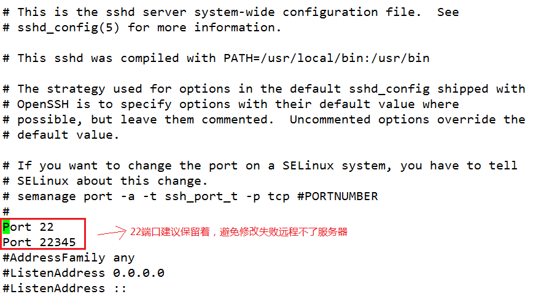

CentOS7修改SSH端口

注意，先不要删掉22端口，等配置完新端口重启后新端口连接正常再删除22端口。

1. 防火墙放行

```
firewall-cmd --zone=public --add-port=22345/tcp --permanent
firewall-cmd --zone=public --add-port=22345/tcp
```

2. 修改ssh配置文件sshd_config

```
vi /etc/ssh/sshd_config
```



3. 向SELinux中添加修改的SSH端口

先安装SELinux的管理工具 semanage (如果已经安装了就直接到下一步) ：

```
yum provides semanage
```

安装运行semanage所需依赖工具包 policycoreutils-python：

```
yum -y install policycoreutils-python
```

查询当前 ssh 服务端口
```
semanage port -l | grep ssh
```

向 SELinux 中添加 ssh 端口：
```
semanage port -a -t ssh_port_t -p tcp 22345
```

重启 ssh 服务：
```
systemctl restart sshd.service
```

测试成功后，把22端口注释掉即可

