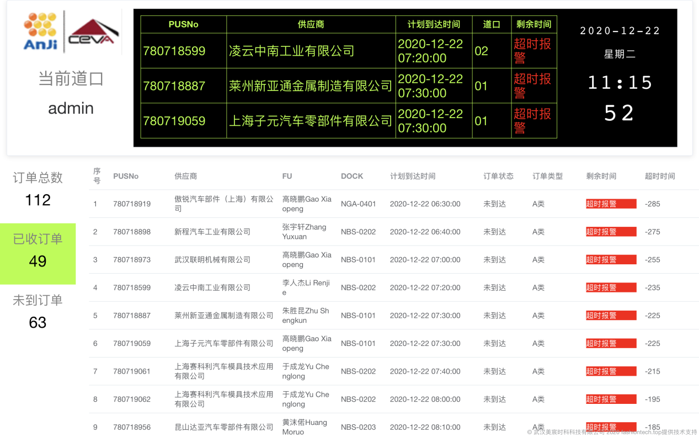
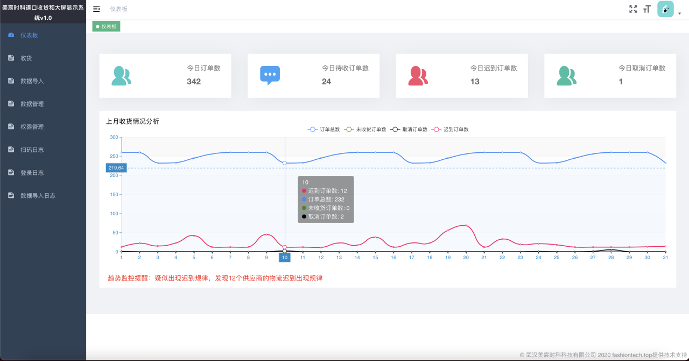

# 美宸时科道口收货和大屏显示系统

## 软件名称
美宸时科道口收货和大屏显示系统

## 发布时间
2020-12-18

## 面向领域/行业
汽车、电子产品、以及其他需要大量零配件供应总装的总装工厂
任何大型仓库的道口收货领域

## 开发目的
解决总装工厂的零配件收货道口收货效率低下、易错乱、无法依据历史数据进行工作过程改进和追责

## 大屏看板-让道口收货工作高效有序

## 统计分析-支撑道口收货工作持续改进

## 软件主要功能：
主要功能包括：用户登录、仪表板（统计和分析）、道口大屏、数据导入导出、数据管理、数据权限管理、收货、扫码日志、登录日志、数据导入日志

## 软件技术特点：
该软件是基于Web应用开发技术开发，能使用在手机、电视、平板电脑等多种设备上，后端利用go语言开发，天生多核和分布式支持，利用云计算资源进行业务程序的运行、数据统计和分析;界面美观、功能实用性能突出

## 开发环境/开发工具：
node12, goland,go1.14.6,mysql5.7,consul,nginx

## 运行软件的硬件环境：
CPU PIII或以上,内存100MB或以上,硬盘500MB或以上

## 运行软件的操作系统/平台：
windows, linux,macOS

## 有兴趣

* 对本产品感兴趣请移步 [美宸时科道口收货和大屏显示系统产品页面](https://www.fashiontech.top/product/dock/dock_v1.html)
* 更多产品信息请移步 [美宸时科微应用官网](https://microapp.fashiontech.top)