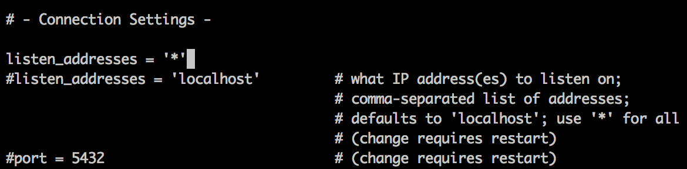
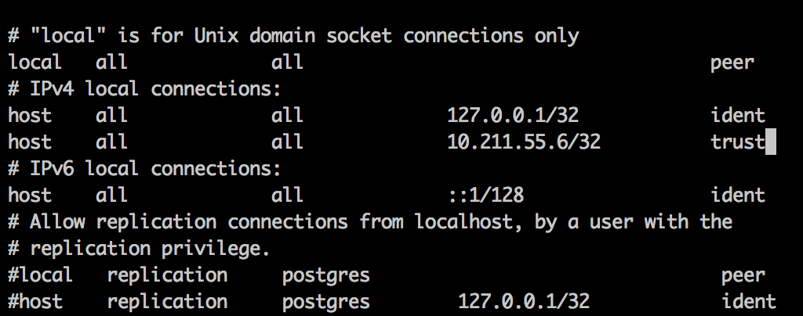

# Postgresql安装和简单使用

CentOS Yum 工具安装，简单方便，官方源列表，RPM LIST。
```
添加RPM  
yum install https://download.postgresql.org/pub/repos/yum/9.6/redhat/rhel-7-x86_64/pgdg-centos96-9.6-3.noarch.rpm

安装PostgreSQL 9.6
postgresql96-server  数据库核心服务端
postgresql96-contrib  附加第三方扩展
postgresql96-devel  C语言开发Header头文件和库
yum install postgresql96-server postgresql96-contrib postgresql96-devel
验证是否安装成功
rpm -aq| grep postgres
默认Postgresql数据库路径是 /var/lib/pgsql/9.6/data ，可以新建一个目录，假如是/mnt/vdb1
cd /mnt
sudo mkdir vdb1
sudo chown -R postgres:postgres vdb1
sudo chmod 700 vdb1
vi /usr/lib/systemd/system/postgresql-9.6.service
Environment=PGDATA=/mnt/vdb1/  修改为自己的新的数据路径
初始化数据库
/usr/pgsql-9.6/bin/postgresql96-setup initdb
开启服务
service postgresql-9.6start  或者 systemctl start postgresql-9.6.service
开机启动
sudo chkconfig postgresql-9.6 on  或者 systemctl enable postgresql-9.6.service
修改密码
su postgres
psql
ALTER USER postgres WITH PASSWORD '密码';   --必须以分号结束，成功执行后会出现ALTER ROLE
\q
su root
开启远程访问
vi /var/lib/pgsql/9.6/data/postgresql.conf  或者  vi /mnt/vdb1/postgresql.conf
修改#listen_addresses = 'localhost'  为  listen_addresses='*'
当然，此处‘*’也可以改为任何你想开放的服务器IP
```


```
信任远程连接
vi /var/lib/pgsql/9.6/data/pg_hba.conf  或者  vi /mnt/vdb1/pg_hba.conf
修改如下内容，信任指定服务器连接
# IPv4 local connections:
host    all            all      127.0.0.1/32      md5
host    all            all      10.211.55.6/32（需要连接的服务器IP）  md5
```



```
重启服务
service postgresql-9.6 restart 或者 systemctl restart postgresql-9.6.service
打开防火墙
CentOS 防火墙中内置了PostgreSQL服务，配置文件位置在/usr/lib/firewalld/services/postgresql.xml，我们只需以服务方式将PostgreSQL服务开放即可。
systemctl enable firewalld 开机启用防火墙
systemctl start firewalld 开启防火墙
firewall-cmd --add-service=postgresql --permanent   开放postgresql服务
firewall-cmd --zone=public --add-port=5432/tcp --permanent 或者可以直接添加端口
firewall-cmd --reload  重载防火墙
firewall-cmd --list-ports 查看占用端口
简单使用：
psql -U postgres postgres  连接数据库
说明：-h表示主机（Host），-p表示端口（Port），-U表示用户（User）
显示所有数据库： \l

卸载PostgreSQL
yum erase postgresql96
结束

```

## Postgresql默认用户名与密码

CREATE DATABASE语句的基本语法如下：
```

CREATE DATABASE dbname;
```

```
在UNIX平台中安装PostgreSQL之后，PostgreSQL会在UNIX系统中创建一个名为“postgres”当用户。PostgreSQL的默认用户名和数据库也是“postgres”，
不过没有默认密码。在安装PostgreSQL之后可以以默认用户登录，也可以创建新当用户名。
以默认用户登录

Yu@Coat ~ $ sudo su postgres           #切换至postgres
postgres@Coat /home/Yu $ psql postgres#登入默认数据库
[sudo] passwordfor Yu: 
psql (9.1.6)
Type "help" for help.
以上命令也可以简化为：
Yu@Coat ~ $ sudo -u postgres psql postgres
登录之后给默认用户“postgres”设置密码
postgres=# \password postgres          #给postgres用户设置密码
Enter new password: 
Enter it again: 
postgres=#
创建新用户

在UNIX shell中“createuser”命令可以创建用户。
sudo -u postgres createuser username#以“postgres”用户执行 createuser username语句
如果有以下提示
createuser: could not connect to database postgres:
FATAL:  role "xxx" does not exist
是因为只有UNIX系统中的postgres用户才能用createuser/dropuser创建或者删除数据库中的用户（role）。
```