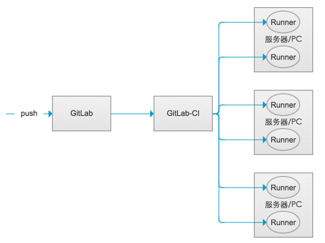

[后端]gitlab之gitlab-ci自动部署
144  作者 st0rm23 关注
2016.12.21 01:19 字数 1428 阅读 837评论 2喜欢 5
简介

gitlab-ci全称是gitlab continuous integration的意思，也就是持续集成。中心思想是当每一次push到gitlab的时候，都会触发一次脚本执行，然后脚本的内容包括了测试，编译，部署等一系列自定义的内容。本文就是利用gitlab-ci的持续集成来实现自动部署。相比之前webhook的自动部署还是强大以及方便了许多。

原理

自动部署涉及了若干个角色，主要介绍如下

GitLab-CI
这个是一套配合GitLab使用的持续集成系统，是GitLab自带的，也就是你装GitLab的那台服务器上就带有的。无需多考虑。.gitlab-ci.yml的脚本解析就由它来负责。

GitLab-Runner
这个是脚本执行的承载者，.gitlab-ci.yml的script部分的运行就是由runner来负责的。GitLab-CI浏览过项目里的.gitlab-ci.yml文件之后，根据里面的规则，分配到各个Runner来运行相应的脚本script。这些脚本有的是测试项目用的，有的是部署用的。

GitLab-CI与GitLab-Runner关系示意图
.gitlab-ci.yml
这个是在git项目的根目录下的一个文件，记录了一系列的阶段和执行规则。GitLab-CI在push后会解析它，根据里面的内容调用runner来运行。
步骤

安装GitLab-CI
这个不用安装了，装好GitLab就自带了
安装GitLab-Runner
在centOS上安装gitlab-ci-multi-runner

$ curl -L https://packages.gitlab.com/install/repositories/runner/gitlab-ci-multi-runner/script.rpm.sh | sudo bash
$ yum install gitlab-ci-multi-runner
这样就装好了gitlab-ci-multi-runner，然而我们只是装好了gitlab-runner，当然我们要接着向gitlab-CI注册这个runner，不然gitlab-CI在push事件到来的时候怎么知道要调用谁呢？这里也可以发现和webhook方式的区别，webhook方式是我们主动配置了一个连接给gitlab；gitlab-runner只要注册一下就好了。

那么我们就注册一下

$ gitlab-ci-multi-runner register
#引导会让你输入gitlab的url，输入自己的url，例如http://gitlab.example.com/
#引导会让你输入token，去相应的项目下找到token，例如ase12c235qazd32
#引导会让你输入tag，一个项目可能有多个runner，是根据tag来区别runner的，输入若干个就好了，比如web,hook,deploy
#引导会让你输入executor，这个是要用什么方式来执行脚本，图方便输入shell就好了。
然后就注册好了，在gitlab中相应的位置就可以看到你注册好的runner信息。

编写.gitlab-ci.yml
在项目根目录下编写.gitlab-ci.yml这样在push之后，gitlab-ci就会自动识别来解析了。

stages:
- deploy
deploy:
  stage: deploy
  script:
    - deploy Example_Group Example_Project
  only:
    - master
  tags:
    - shell
这里我们只有一个stage是deploy。only指定了只有在master分支push的时候才会被执行。tags是shell，对应了刚才注册runner的时候的tags。

最重要的script部分deploy Example_Group Example_Project，这里是一条shell指令，为了方便通用性，deploy是我在服务器上编写的一个脚本，传入参数是Example_Group Example_Project分别是项目组名和项目名。执行这一条指令就能够自动部署到/xxx/Example_Group/Example_Project的服务器目录下。那么随便什么项目都用这个格式去套就好了，这样新项目的自动部署也不需要登录到服务器上去修改了。

编写deploy脚本
在gitlab-runner的~/.local/bin/目录下新建deploy文件

$ su gitlab-runner
$ mkdir ~/.local/bin
$ cd ~/.local/bin
$ touch deploy
并编辑成如下内容

#!/bin/bash
if [ $# -ne 2 ]
then
      echo "arguments error!"
      exit 1
else
      deploy_path="/var/exmaple/$1/$2"
      if [ ! -d "$deploy_path" ]
      then
              project_path="git@gitlab.example.com:"$1/$2".git"
              git clone $project_path $deploy_path
      else
              cd $deploy_path
              git pull
      fi
fi
这个脚本的大意就是，如果目录不存在，那么就git clone一个，如果存在了就git pull一个到指定目录下。这样就达到了自动部署的目的。

加上执行权限，然后把这个脚本放在gitlab-runner的~/.local/bin下就可以生效了（为了不用写难看的./deploy）

$ chmod +x ~/.local/bin/deploy
配置ssh登录
上面的deploy脚本是用ssh方式来和gitlab联系的。所以要给gitlab-runner这个用户配置一个gitlab上能ssh的用户。首先在gitlab-runner下生成一个密钥对

$ mkdir ~/.ssh
$ cd ~

$ ssh-keygen
# 提示输入一直按回车默认就可以了
$ cat id_rsa.pub
用cat查看公钥，然后复制这一串公钥。在gitlab中新建一个账号比如叫gitlab-runner，把这个账号添加到你的项目成员中，然后在这个账号的user_profile里面，把公钥粘贴进去就好了。总之就是把这个账号配置成能用ssh登录的。

移交部署目录权限
有些同学可能说脚本执行失败了，有一个原因是/var/example的所有者是root，gitlab-runner并没有权限新建文件。所以我们把/var/example目录的所有者交给gitlab-runner

$ chown -hR gitlab-runner:gitlab-runner /var/example
这样就大功告成了。

尝试一下git push到相应项目，然后到服务器上的目录看一下是不是有了呢。

参考文档

GitLab-CI与GitLab-Runner
GitLab官方材料