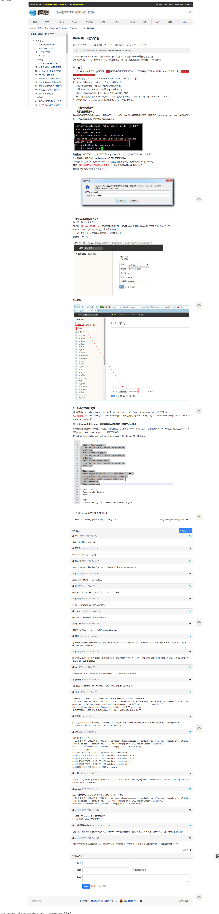

# 迁移禅道

使用一键安装包的禅道最好迁移：
~~~
linux scp admin@192.168.2.111:/opt/zbox/ ./
~~~
使用如上命令就可以实现迁移，也就是说一键安装包安装的禅道只需要拷贝整个禅道的目录就行了
~~~
需要注意：
迁移禅道之前需要停止禅道的apache和mysql服务
~~~

参考：
~~~
一、安装
1、将安装包直接解压到/opt目录下，不要解压到别的目录再拷贝到/opt/，因为这样会导致文件的所有者和读写权限改变，也不要解压后把整个目录777权限。
可以使用命令： tar -zxvf  ZenTaoPMS.7.3.stable.zbox_32.tar.gz -C /opt
2、执行/opt/zbox/zbox start 命令开启Apache和Mysql。
     执行/opt/zbox/zbox stop 命令停止Apache和Mysql。
     执行/opt/zbox/zbox restart 命令重启Apache和Mysql。
     可以使用/opt/zbox/zbox -h命令来获取关于zbox命令的帮助
     其中 -ap参数 可以修改Apache的端口，-mp参数 可以修改Mysql的端口（比如：/opt/zbox/zbox -ap 8080）
3、浏览器访问 http://ip:apache端口 (默认帐号 admin，密码 123456)
~~~

官网的安装页面：

